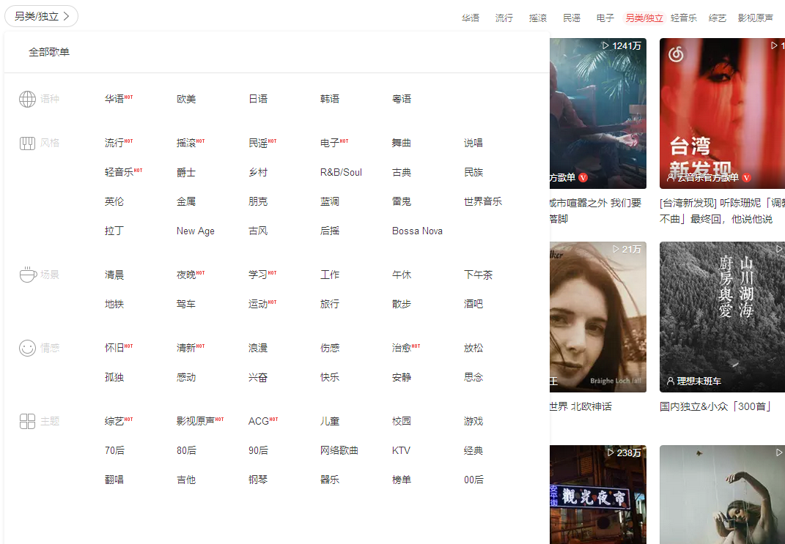

# 发现音乐

# 个性推荐
- [x] 首页轮播组件
## 推荐歌单
接口 >>> https://music-cloud-node-api.vercel.app/personalized?limit=10
- [ ] 歌曲卡片组件(正方形)

- [ ] 歌曲卡片列表(grid)组件
## 独家放送
接口 >>> https://music-cloud-node-api.vercel.app/personalized/privatecontent
- [ ] 歌曲卡片组件(矩形)

## 最新音乐
接口 >>> https://music-cloud-node-api.vercel.app/top/song?type=0
- [ ] 歌曲小卡片组件

## 推荐MV
接口 >>> /personalized/mv

## 热门播客、听听、看看
二期再搞

## 调整栏目功能

## 技术
存储到pinia，退出前存储到本地持久化，做策略更新（每日一更？）

# 歌单

> 分类接口 >>> https://music-cloud-node-api.vercel.app/playlist/catlist
> 热门分类 >>> https://music-cloud-node-api.vercel.app/playlist/hot
# 排行榜
> 接口 >>> https://music-cloud-node-api.vercel.app/toplist
# 歌手
> 接口 >>> https://music-cloud-node-api.vercel.app/artist/list?type=1&area=96&initial=b
# 最新音乐
> (新歌速递)接口 >>> https://music-cloud-node-api.vercel.app/top/song?type=0
> (新碟上架)接口 >>> /top/album?offset=0&limit=30&year=2019&month=6